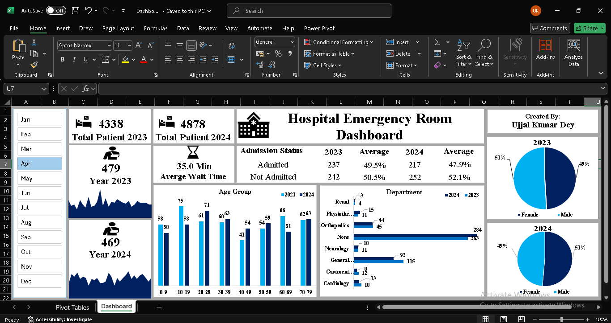
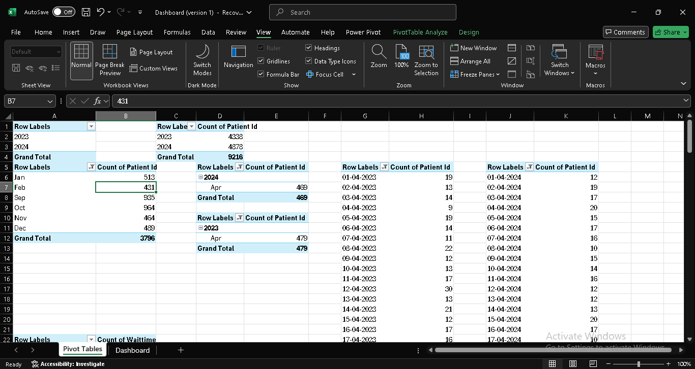
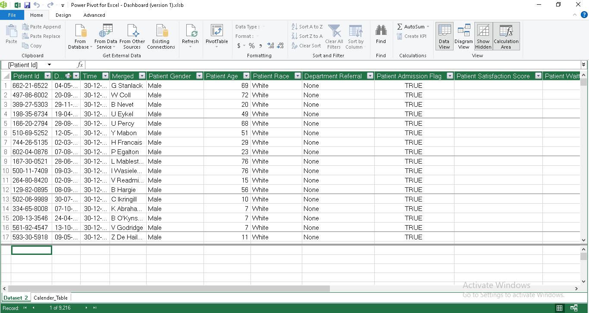
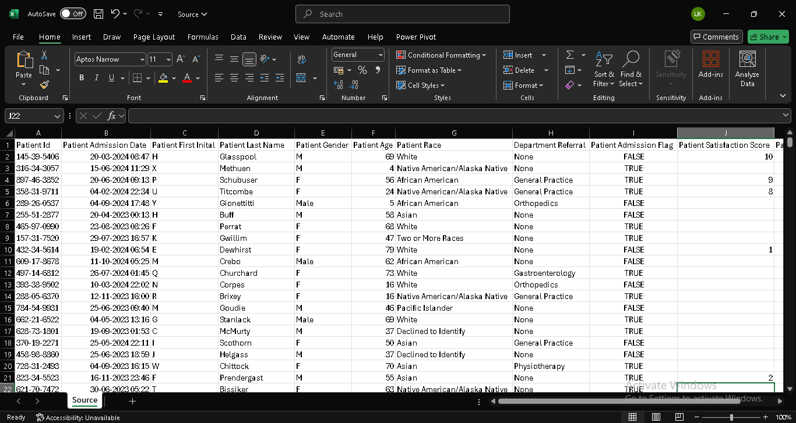

# 🏥 Hospital Emergency Room Dashboard - MS Excel

This interactive dashboard presents a comprehensive analysis of emergency room (ER) activity for the years 2023 and 2024. Built for data visualization and storytelling, the dashboard helps uncover trends in patient volume, admission rates, wait times, and departmental visits.

## 📊 Key Features

- 📅 **Monthly ER Visit Trends** (2023 vs 2024)
- 👥 **Total Patients per Year**
- 🔍 **Gender-wise Distribution** (Pie Charts)
- ⌛ **Average Wait Time Visualization**
- 🏥 **Admission vs Non-Admission Stats**
- 🧠 **Age Group-Based Analysis**
- 🧑‍⚕️ **Department-wise Visits (Bar Chart)**

## 📁 Project Structure
```
📁 Hospital-Emergency-Room-Dashboard
│── img/               
│── Dashboard.xlsx     # Excel file with pivot tables and dashboard
│── Source.csv         # Raw data used for the analysis
│── README.md          # Project documentation (this file)

```
## 🚀 How to Run the Project

This dashboard was built using **Microsoft Excel**. You can explore it by following these steps:

### 🔹 Step 1: Download the Files

Option 1:  
Click on the green `Code` button in this GitHub repo and select:

```bash
Download ZIP
```

Option 2: Clone the repository:
```bash
git clone https://github.com/yourusername/Hospital-Emergency-Room-Dashboard.git
cd Hospital-Emergency-Room-Dashboard

```

### 🔹 Step 2: Open the Excel Dashboard

1. Open the file Dashboard.xlsx using Microsoft Excel (2016 or later recommended).
2. Go to the Dashboard sheet to view the visual charts and KPIs.
3. Use slicers (if available) to filter data by year, gender, department, etc.
4. Optionally, view the pivot table logic in the PivotTable or Data sheets.

### 🔹 Step 3: Explore the Dataset

1. Open Source.csv to view the raw data used for the dashboard.
2. Refer to pivot.png or source.png for screenshots of how the pivot logic and data structure were set up.

## 🖼️ Screenshots

<p align="center">
  
  <br><em>Dashboard</em>
</p>

<p align="center">
  
  <br><em>Pivot Tables</em>
</p>

<p align="center">
  
  <br><em>Transformed Data</em>
</p>

<p align="center">
  
  <br><em>Raw Data</em>
</p>

## 📊 Key Insights

- 👥 Total patients: 4,338 (2023) → 4,878 (2024)
- ⏳ Average wait time: 35.5 minutes
- 🚻 Gender distribution: fairly balanced in both years
- 🧑‍⚕️ Most visited department: General
- 📈 Most common age group: 20–29 years
- 🏥 Admission rate slightly dropped from 49.8% to 49.1%

 ## 🛠️ Tools Used

- Microsoft Excel – Pivot tables, charts, and slicers 
- CSV Dataset – Raw ER data

## 🔮 Future Scope

- Publish as an interactive web dashboard using Power BI
- Add filters for age group, year, and department
- Automate real-time data refresh using Power Query


## 👨‍💻 Contributors

- **Ujjal Kumar Dey** 
